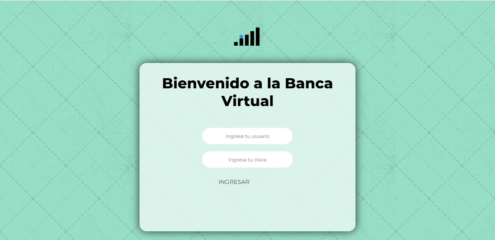

<h1 align="center">¡Hola!, Mi nombre es Cristian Javier Arias Ordoñez</h1>
<h4>Te comento que se realizo una App sobre un cajero automatico, donde muestra el saldo de los usuarios que están ingrsados, tambien puede agrear mas saldo y retiralos</h4>
 
<h2> Cajero Autómatico</h2>
<a href="https://cristian0813.github.io/Cajero-automatico/">
 
 
<h3 align="left">Languages de programación:</h3>
 

  

