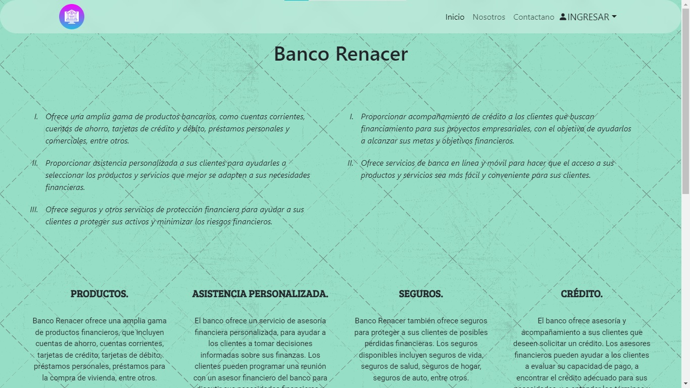
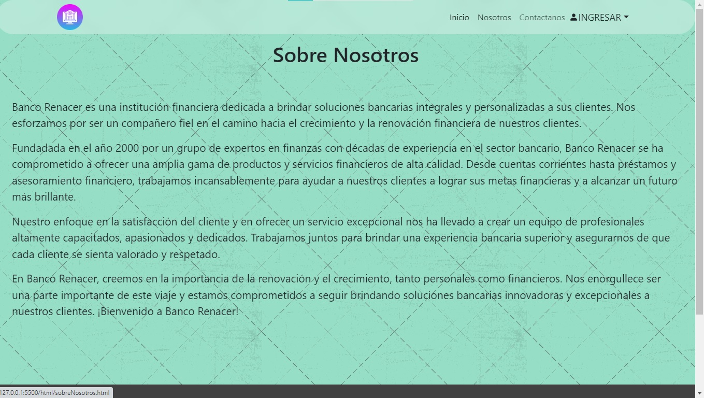
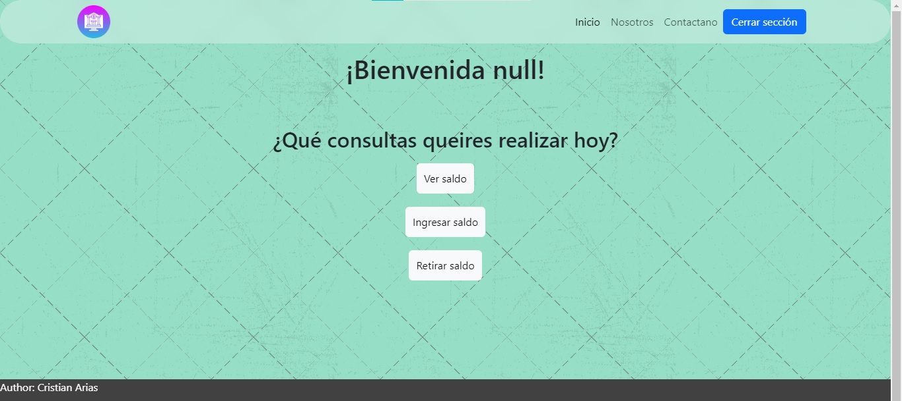
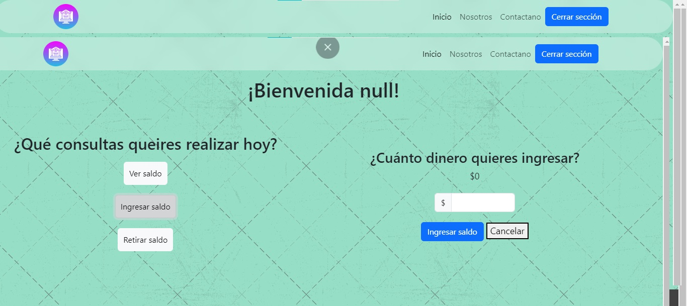
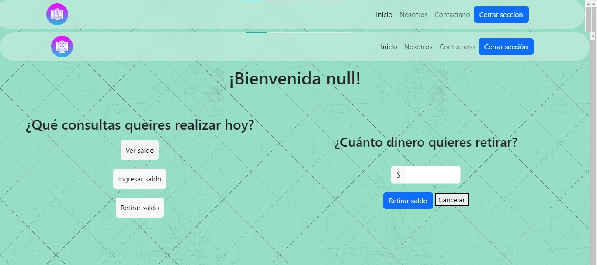

<h1 align="center">¡Hola!, Mi nombre es Cristian Javier Arias Ordoñez</h1>

Te comento que se realizó una App sobre un cajero automático, donde muestra el saldo de los usuarios que están ingresados, también puede agregar más saldo y retíralos

 
<h2>Actualizacion</h2>

Se actualiza la App cajero automático, cambiando el nombre como Banco Renacer, brindado una mejor experiencia, también se cambia por completo la interfaz respetando la adaptabilidad al usuario.

 

Para el ingreso se crea tres clientes con su clave

Usuario: Mali Clave: 1234

Usuario: Gera Clave: 5678

Usuario: Maui Clave: 9999

Se agregó nuevas imágenes, una sección de nosotros y pie de página donde se evidencia el contacto.

 
<h2> Cajero Autómatico</h2>
<a href="https://cristian0813.github.io/Cajero-automatico/">
 
 
 
<a href="https://cristian0813.github.io/Cajero-automatico/">
 
 
 
<a href="https://cristian0813.github.io/Cajero-automatico/">
 
 
 
<a href="https://cristian0813.github.io/Cajero-automatico/">
 
 
 
<a href="https://cristian0813.github.io/Cajero-automatico/">
 
 
 
<a href="https://cristian0813.github.io/Cajero-automatico/">
 
 
<h3 align="left">Languages de programación:</h3>
 

        

